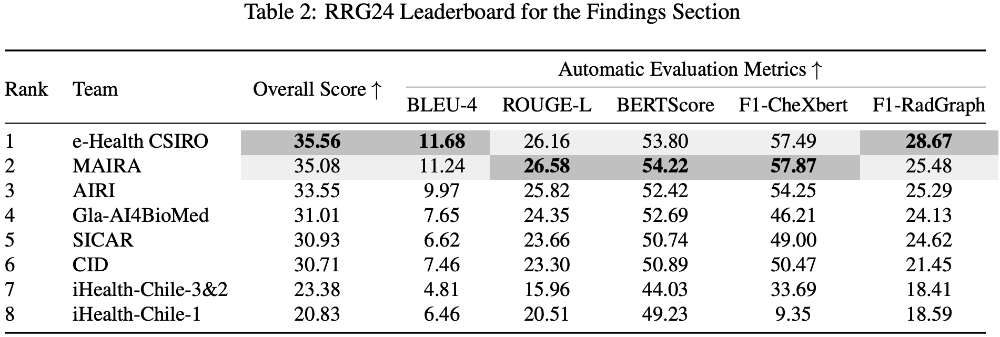

# Med-CXRGen: Visual Instruction-tuned Adaptation for Radiology Report Generation (Gla-AI4BioMed at RRG24)

[](https://huggingface.co/collections/X-iZhang/gla-ai4biomed-at-rrg24-67747a3d615ea14619e7a23e)
[](https://arxiv.org/abs/2412.04954) 
[](https://huggingface.co/datasets/StanfordAIMI/rrg24-shared-task-bionlp)
[](https://github.com/X-iZhang/RRG-BioNLP-ACL2024/blob/main/LICENSE) 
[](https://visitorbadge.io/status?path=https%3A%2F%2Fgithub.com%2FX-iZhang%2FRRG-BioNLP-ACL2024)

*🚨 This repository hosts the installation scripts, runtime environment, and usage instructions for **Med-CXRGen**. The project is designed to be fully compatible with the [Libra space](https://github.com/X-iZhang/Libra) for seamless integration.*

## 🔥 News
- **[20 Jun 2024]** 🏆 Gla-AI4BioMed ranked **4th** place in the Shared Task on Large-Scale Radiology Report Generation @ [BioNLP ACL'24](https://aclanthology.org/2024.bionlp-1.7/)! 🎉
- **[08 Jun 2024]** 🚀 Released model weights:
  - ✅ [Med-CXRGen-F](https://huggingface.co/X-iZhang/Med-CXRGen-F) for generating the `Findings` section.
  - ✅ [Med-CXRGen-I](https://huggingface.co/X-iZhang/Med-CXRGen-I) for generating the `Impression` section.

<details open><summary>Model Ranking at BioNLP @ ACL2024</summary>



</details>

## Overview

We introduce a radiology-focused visual language model designed to generate radiology reports from chest X-rays. Building on previous findings that large language models (LLMs) can acquire multimodal capabilities when aligned with pretrained vision encoders, we demonstrate similar potential with chest X-ray images. Our model combines an image encoder with a fine-tuned LLM based on the Vicuna-7B architecture, enabling it to generate different sections of a radiology report with notable accuracy.

<details open><summary>Training Framework</summary>


</details>

## Contents
- [Install](#install)
  - [Step 1: Clone with submodules](#step-1-clone-with-submodules)
  - [Step 2: Create and activate a Conda environment](#step-2-create-and-activate-a-conda-environment)
  - [Step 3: Install Libra](#step-3-install-libra-inside-the-submodule)
- [Model Weights](#model-weights)
    - [Med-CXRGen](#med-cxrgen-libra-v05)
    - [Projector weights](#projector-weights)
- [Quick Start](#quick-start)
    - [🧩 Concatenate Images](#-concatenate-images)
    - [CLI Inference](#cli-inference)
    - [Script Inference](#script-inference)
- [Data Preparation](#data-preparation)
- [Evaluation](#evaluation)
  
## Install

This project depends on [**Libra repository**](https://github.com/X-iZhang/Libra), which is included as a Git submodule (version [`v1.0.1`](https://github.com/X-iZhang/Libra/releases/tag/v1.0.1)). Below is a brief outline for quick setup:

### Step 1: Clone with submodules

```Shell
git clone --recurse-submodules https://github.com/X-iZhang/RRG-BioNLP-ACL2024.git
cd RRG-BioNLP-ACL2024
```


<details>
<summary>  💡 Note: If you’ve already cloned without --recurse-submodules, you can run: </summary>

```Shell
git submodule update --init --recursive
```

</details>


### Step 2: Create and activate a Conda environment

```Shell
conda create -n cxrgen python=3.10 -y
conda activate cxrgen
```

### Step 3: Install Libra (inside the submodule)

```Shell
cd Libra
pip install --upgrade pip  # enable PEP 660 support
pip install -e .
```

🪧 For more detailed instructions, see [Libra's README](https://github.com/X-iZhang/Libra/tree/main#install).


## Model Weights
### Med-CXRGen (Libra-v0.5)

| Version | Size | Projector | Base LLM | Vision Encoder| Checkpoint |
| ------- | ------- | ------- | ------- | ------- | ------- |
| Libra-0.5 | 7B | MLP-2x | Vicuna-7B | CLIP-L-336px | [Med-CXRGen-F](https://huggingface.co/X-iZhang/Med-CXRGen-F) |
| Libra-0.5 | 7B | MLP-2x | Vicuna-7B | CLIP-L-336px | [Med-CXRGen-I](https://huggingface.co/X-iZhang/Med-CXRGen-I) |

*Note: These two models are fine-tuned for `Findings` and `Impression` section generation.*

### Projector weights

These projector weights were pre-trained for visual instruction tuning on chest X-ray to text generation tasks. They can be directly used to initialise your model for multimodal fine-tuning in similar clinical domains.

⚠️ Important Note: For compatibility, please ensure that the `projector type`, `base LLM`, `conv_mode`, and `vision encoder` exactly match those used in our projector pretraining setup. Please also ensure the following settings are correctly configured during instruction tuning:

```Shell
--mm_projector_type mlp2x_gelu \
--mm_vision_select_layer -2 \
--mm_vision_select_feature patch \
--mm_use_im_start_end False \
--mm_use_im_patch_token False \
```

| Base LLM | conv_mode | Vision Encoder | Projector | Pretrain Data | Download |
| ----------- | ----------- | ----------- | ----------- | ----------- | ----------- |
| Vicuna-7B| libra_v0 | CLIP-L-336px| MLP-2x | [Findings section](https://huggingface.co/datasets/StanfordAIMI/rrg24-shared-task-bionlp) | [projector](https://huggingface.co/X-iZhang/Med-CXRGen-F/resolve/main/mm_mlp2x_projector_findings.bin) |
| Vicuna-7B | libra_v0 | CLIP-L-336px | MLP-2x | [Impression section](https://huggingface.co/datasets/StanfordAIMI/rrg24-shared-task-bionlp) | [projector](https://huggingface.co/X-iZhang/Med-CXRGen-I/resolve/main/mm_mlp2x_projector_impressions.bin) |

## Quick Start

### 🧩 Concatenate Images
This model supports multiple images (1 to 4) as input during training. You can use the following method to preprocess and horizontally concatenate multiple images (e.g. generating one report from several diagnostic images):

```Python
from PIL import Image

def concatenate_images(images):
    total_width = sum(img.width for img in images) + 10 * (len(images) - 1)
    height = max(img.height for img in images)

    new_img = Image.new('RGB', (total_width, height), (0, 0, 0))

    current_width = 0
    for img in images:
        new_img.paste(img, (current_width, 0))
        current_width += img.width + 10  # Add a 10px black separator between images

    return new_img

# Load images (make sure the paths are correct or use your own images)
img1 = Image.open('chest_x_ray_example1.jpg')
img2 = Image.open('chest_x_ray_example2.jpg')
img3 = Image.open('chest_x_ray_example3.jpg')
img4 = Image.open('chest_x_ray_example4.jpg')

# Concatenate images
result_img = concatenate_images([img1, img2, img3, img4])

# Save the result
result_img.save('concatenated_chest_x_ray.jpg')
```

### CLI Inference
We support running inference using the CLI. To use our model, run:
```Shell
python -m libra.serve.cli \
    --model-path X-iZhang/Med-CXRGen-I  \
    --conv-mode libra_v0 \
    --image-file "./path/to/chest_x_ray.jpg"
```

### Script Inference
You can use the `libra_eval` function in `libra/eval/run_libra.py` to easily launch a model trained by yourself or us on local machine or in Google Colab, after installing this repository.

```Python
from libra.eval import libra_eval

model_path = "X-iZhang/Med-CXRGen-I "  # Or "X-iZhang/Med-CXRGen-F " 

# Define the paths to the images. 
image_file = "./path/to/chest_x_ray.jpg" # Or concatenated X-ray image

# Define the prompt to guide the model's response.
prompt = "Provide a detailed description of the impression in the radiology image." 
# Or  "Provide a detailed description of the findings in the radiology image." 

# Specify the conversational mode, matching the PROMPT_VERSION used during training.
conv_mode = "libra_v0"

# Call the libra_eval function.
libra_eval(
    model_path=model_path,
    image_file=image_file,
    query=prompt,
    conv_mode=conv_mode,
    max_new_tokens=512
)
```

## Data Preparation

We use the officially provided dataset from the RRG24 shared task, available on Hugging Face:

👉 [StanfordAIMI/rrg24-shared-task-bionlp](https://huggingface.co/datasets/StanfordAIMI/rrg24-shared-task-bionlp)

You can load the dataset as follows:
```python
from datasets import load_dataset

dataset = load_dataset("StanfordAIMI/rrg24-shared-task-bionlp")
```

### 🛠️ Optional: Prepare MIMIC-CXR Locally

To process **MIMIC-CXR** on your own, you may use the official script [(make-interpret-mimic-cxr.py)](./make-interpret-mimic-cxr.py) provided by the organizers.
Please ensure the following folder structure (with `files/` from [mimic-cxr-jpg](https://physionet.org/content/mimic-cxr-jpg/2.0.0/)):

```shell
.
├── files
│   ├── p10
│   ├── p11
│   ├── ...
│   └── p19
├── make-interpret-mimic-cxr.py
├── mimic-cxr-2.0.0-metadata.csv
├── mimic-cxr-2.0.0-split.csv
└── mimic_cxr_sectioned.csv
```

### 🔗 Combine RRG24 and MIMIC-CXR

After preprocessing, you can merge the RRG24 and your MIMIC-CXR datasets using:

```python
from datasets import load_dataset, Sequence, Image, DatasetDict, concatenate_datasets

dataset = load_dataset("StanfordAIMI/rrg24-shared-task-bionlp")
dataset_mimic = load_dataset(
    "json",
    data_files={"train": "train_mimic.json", "validation": "val_mimic.json"},
).cast_column("images", Sequence(Image()))
dataset_final = DatasetDict({"train": concatenate_datasets([dataset["train"], dataset_mimic["train"]]),
                             "validation": concatenate_datasets([dataset["validation"], dataset_mimic["validation"]])})
dataset_final.save_to_disk("path/to/dataset/directory")
```

🪧 Note: For details on the data structure, preprocessing scripts, and training-ready formats, please refer to the [Libra repository](https://github.com/X-iZhang/Libra), particularly [`Custom_Data.md`](https://github.com/X-iZhang/Libra/blob/main/CUSTOM_DATA.md).


## Evaluation

To ensure reproducibility and output quality, we evaluate our model using the beam search strategy.

### 1. Generate Med-CXRGen responses.

```Shell
python -m libra.eval.eval_vqa_libra \
    --model-path X-iZhang/Med-CXRGen-I \
    --question-file ./path/to/questions_file.jsonl \
    --image-folder ./path/to/image/folder \
    --answers-file /path/to/answer-file.jsonl \
    --num_beams 2 \
    --max_new_tokens 256 \
    --conv-mode libra_v0
```
You can evaluate the models on your custom datasets by converting them into the required [JSONL format](https://github.com/X-iZhang/Libra/blob/main/CUSTOM_DATA.md#evaluation-dataset-format), then running evaluation with [`eval_vqa_libra.py`](https://github.com/X-iZhang/Libra/blob/main/libra/eval/eval_vqa_libra.py).

Additionally, you can execute the evaluation using the command line. For detailed instructions, see [`libra_eval.sh`](https://github.com/X-iZhang/Libra/blob/main/scripts/eval/libra_eval.sh).

```bash
bash ./scripts/eval/libra_eval.sh beam
```

## Acknowledgments 🙏

We extend our gratitude to the BioNLP 2024 [RRG24 Shared Task](https://stanford-aimi.github.io/RRG24/) organisers for providing the baseline pipeline [ViLMedic](https://vilmedic.app/misc/bionlp24/leaderboard) and curating these challenging and exciting tasks.

Also, we sincerely thank the following projects for their contributions:

* [LLaVA](https://github.com/haotian-liu/LLaVA): A Large Language and Vision Assistant, laying the groundwork for multimodal understanding.
* [FastChat](https://github.com/lm-sys/FastChat): An Open Platform for Training, Serving, and Evaluating Large Language Model based Chatbots.
* [LLaMA](https://github.com/facebookresearch/llama): Open and efficient foundation language models that inspired our core language processing capabilities.

## Citation ✒️

If you find our paper useful in your research and applications, please cite using this BibTeX:
```BibTeX
@inproceedings{zhang-etal-2024-gla,
    title = "Gla-{AI}4{B}io{M}ed at {RRG}24: Visual Instruction-tuned Adaptation for Radiology Report Generation",
    author = "Zhang, Xi  and
      Meng, Zaiqiao  and
      Lever, Jake  and
      Ho, Edmond S.L.",
    editor = "Demner-Fushman, Dina  and
      Ananiadou, Sophia  and
      Miwa, Makoto  and
      Roberts, Kirk  and
      Tsujii, Junichi",
    booktitle = "Proceedings of the 23rd Workshop on Biomedical Natural Language Processing",
    month = aug,
    year = "2024",
    address = "Bangkok, Thailand",
    publisher = "Association for Computational Linguistics",
    url = "https://aclanthology.org/2024.bionlp-1.54/",
    doi = "10.18653/v1/2024.bionlp-1.54",
    pages = "624--634",
}
```
