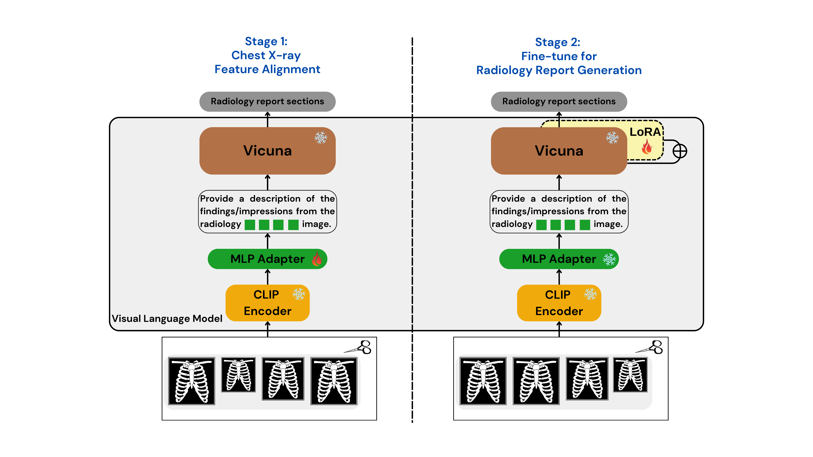

# Gla-AI4BioMed at RRG24: Visual Instruction-tuned Adaptation for Radiology Report Generation
[](https://arxiv.org/abs/2412.04954) 
[](https://github.com/X-iZhang/RRG-BioNLP-ACL2024/blob/main/LICENSE) 

## Overview

We introduce a radiology-focused visual language model designed to generate radiology reports from chest X-rays. Building on previous findings that large language models (LLMs) can acquire multimodal capabilities when aligned with pretrained vision encoders, we demonstrate similar potential with chest X-ray images. Our model combines an image encoder with a fine-tuned LLM based on the Vicuna-7B architecture, enabling it to generate different sections of a radiology report with notable accuracy.

## Project Status

The code is currently being organised and will be available soon. Please check back later for updates.

## Acknowledgments

We extend our gratitude to the BioNLP 2024 RRG24 Shared Task organisers for providing the baseline pipeline ViLMedic and curating these challenging and exciting tasks.

## Citation

If you find our paper useful in your research and applications, please cite using this BibTeX:
```BibTeX
@inproceedings{Zhang_2024,
   title={Gla-AI4BioMed at RRG24: Visual Instruction-tuned Adaptation for Radiology Report Generation},
   url={http://dx.doi.org/10.18653/v1/2024.bionlp-1.54},
   DOI={10.18653/v1/2024.bionlp-1.54},
   booktitle={Proceedings of the 23rd Workshop on Biomedical Natural Language Processing},
   publisher={Association for Computational Linguistics},
   author={Zhang, Xi and Meng, Zaiqiao and Lever, Jake and Ho, Edmond S.L.},
   year={2024},
   pages={624–634}
}
```
